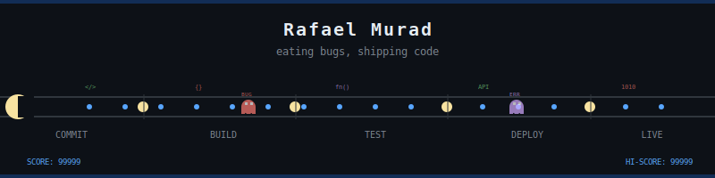

## Pick a banner! (Temporary - will be cleaned up)

---

### 1. Robot Walker
*Pixel robot walking across a conveyor belt carrying code bits, lightbulb ideas*

---

### 2. Pac-Man Pipeline
*Pac-Man chomping through code dots, avoiding bug ghosts*

---

### 3. Minecart Express
*Pixel minecart on rails hauling code blocks through stations*

---

### 4. Factory Assembly Line
*Robotic arms processing code blocks on a factory conveyor*

---

### 5. Rocket Launch
*Rocket flying through space with orbiting code bits, passing planet stages*

---

### 6. Drone Delivery
*Delivery drone carrying code packages to drop zones along the pipeline*

---

### 7. Code River
*Code blocks floating downstream through checkpoint gates*

---

### 8. Pipe Warp (Mario-style)
*Character running through warp pipes, hitting question blocks for code*

---

### 9. Dev Cat
*Pixel cat batting code bits across the desk, chasing bug mice*

---

### 10. Terminal + CI/CD Dashboard
*Split-screen: terminal typing deploy commands + live pipeline dashboard*

